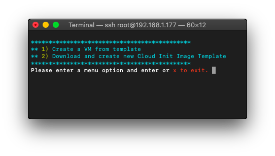

# PACII
Proxmox Automated Cloud Init Script



## RUN
```
git clone https://github.com/koko004/PACII/
cd PACII
chmod +x pacii.sh
./pacii.sh
```
1. Create Template from download link Cloud-Init Image
2. Create VMs from template

