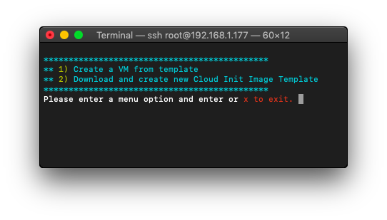

# PACII
Proxmox Automated Cloud Init Script



## Cloud Init Script
Ubuntu: https://cloud-images.ubuntu.com/

Debian: https://cloud.debian.org/images/cloud/

```
git clone https://github.com/koko004/PACII/
cd PACII
chmod +x pacii.sh
./pacii.sh
```
1. Create Template from download link Cloud-Init Image
2. Create VMs from template
## Wake On Lan Proxmox

```
chmod +x pacii-proxmox-WOL.sh
./pacii-proxmox-WOL.sh
```
